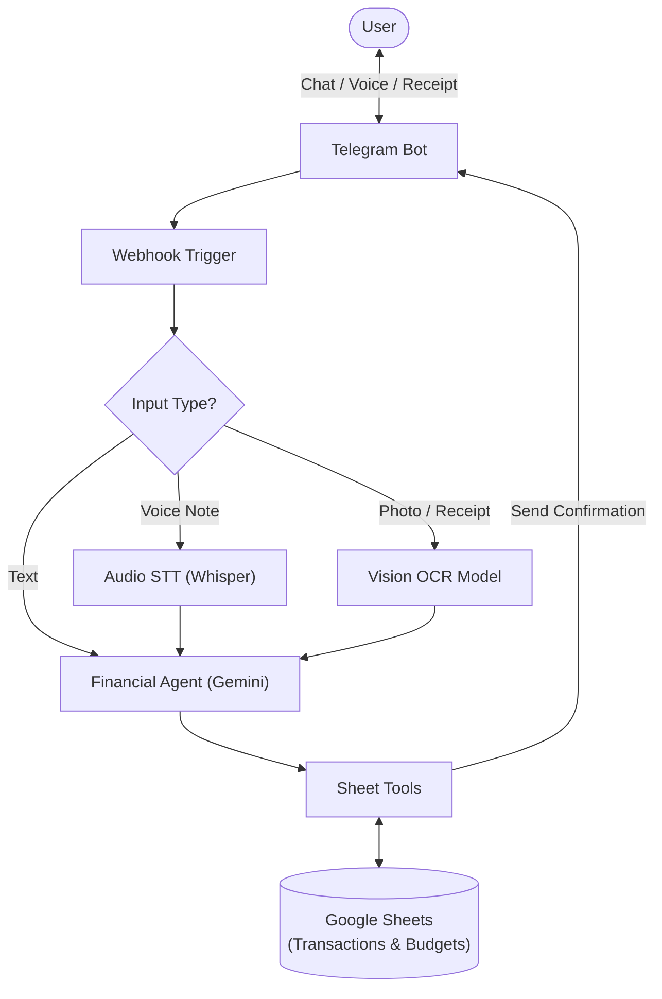
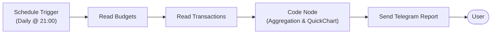

# AI Financial Copilot (Telegram Bot + n8n)

An intelligent, modular personal finance assistant powered by **n8n**, **Google Gemini**, and **Google Sheets**. It automates expense tracking, voice/receipt ingestion, category-based budgeting, and delivers automated scheduled financial health reports directly to your Telegram.

## Key Features

- **Multi-Modal Input Support (Sub-Workflow):**
  - **Text:** Natural language message logging (e.g., *"Beli makan 25rb"*).
  - **Voice Notes:** Automatic speech-to-text audio transcription.
  - **Receipts / Photos:** OCR image analysis to extract amounts and descriptions automatically.

- **AI Financial Agent Core:**
  - Standardized transaction normalization (`income` vs `expense`, category mapping, dynamic timestamping).
  - Multi-tool architecture with Google Sheets database integration and custom calculations.

- **Dynamic Budgeting & Overspending Alerts:**
  - Real-time comparison between current spending and monthly category limits (`budgets` sheet).
  - Visual status badges (`✅ Safe`, `⚠️ Warning 80%`, `🚨 Overbudget 100%+`).

- **Proactive Scheduled Reporting:**
  - Automated daily & monthly financial wrap-ups via cron triggers.
  - Zero-LLM cost data aggregation using optimized JavaScript code nodes.
  - Dynamic visual doughnut chart generation powered by QuickChart.

## Tech Stack & Architecture

- **Orchestration:** [n8n](https://n8n.io/) (Modular Main & Sub-workflows)
- **AI Brain:** Google Gemini Chat Model (LangChain Node)
- **Database:** Google Sheets
- **Interface:** Telegram Bot API
- **Visualization:** QuickChart.io

## System Architecture
### 1. Interactive Transaction & Ingestion Flow


### 2. Automated Scheduled Reporting Flow



## 🚀 Getting Started

### 1. Prerequisites
* Docker & Docker Compose installed on your system
* Telegram Bot Token from [@BotFather](https://t.me/BotFather)
* Google Gemini API Key
* Google Cloud Console Service Account (with Google Sheets API enabled)

---

### 2. Environment Setup
Clone the repository and set up your environment variables:

```bash
git clone [https://github.com/gregoryadrs-alt/Fintrack-Agent.git](https://github.com/gregoryadrs-alt/Fintrack-Agent.git)
cd Fintrack-Agent
cp .env.example .env
```

Open .env and fill in your actual credentials, chat ID, and public webhook URL.

---
### 3. Run n8n Instance
Launch your self-hosted n8n container:
```bash
docker compose up -d
```

### 4. Database Setup (Google Sheets)
Create a new Google Spreadsheet with two tabs:

Sheet1 (Transaction Logs): Headers: id, chat_id, type, value, category, payment_method, description, date.

budgets (Monthly Target Limits): Headers: category, monthly_limit.

### 5. Import Workflows
Open the n8n web dashboard at http://localhost:5555.

Import all JSON workflows from the workflows/ directory:

```bash
Smart Financial Agent - Telegram Vers.json ( Main Workflow / Telegram Ingestion)

Switch - File.json ( Multi-Modal Preprocessor Sub-Workflow)

Financial Agent.json ( Core AI Agent Sub-Workflow)

Daily & Monthly Financial Recap.json ( Scheduled Reporter)
```

Connect your Google Service Account credentials and Telegram credentials to their respective nodes.

Set the webhook URL on your Telegram bot trigger.

Toggle all workflows to Active / Published!


